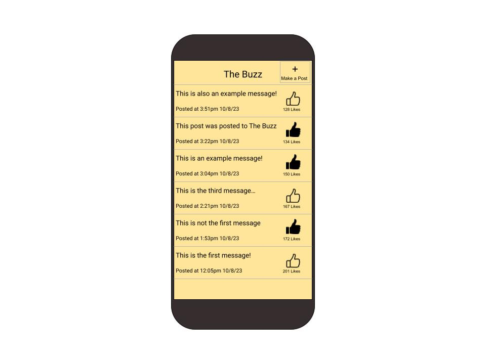
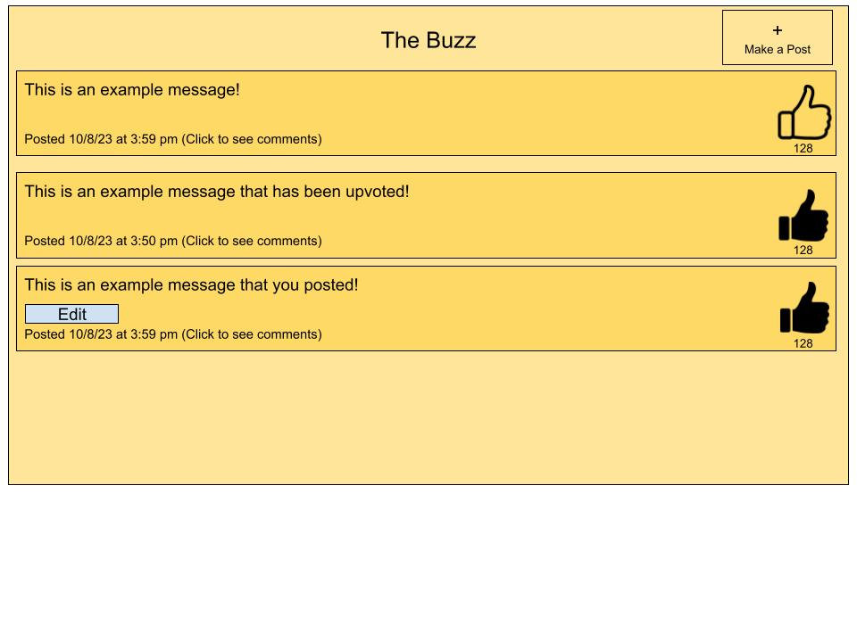
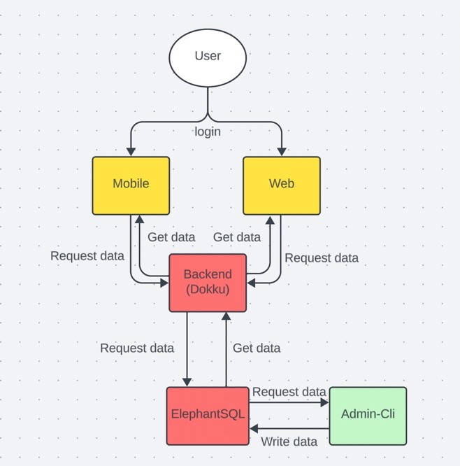
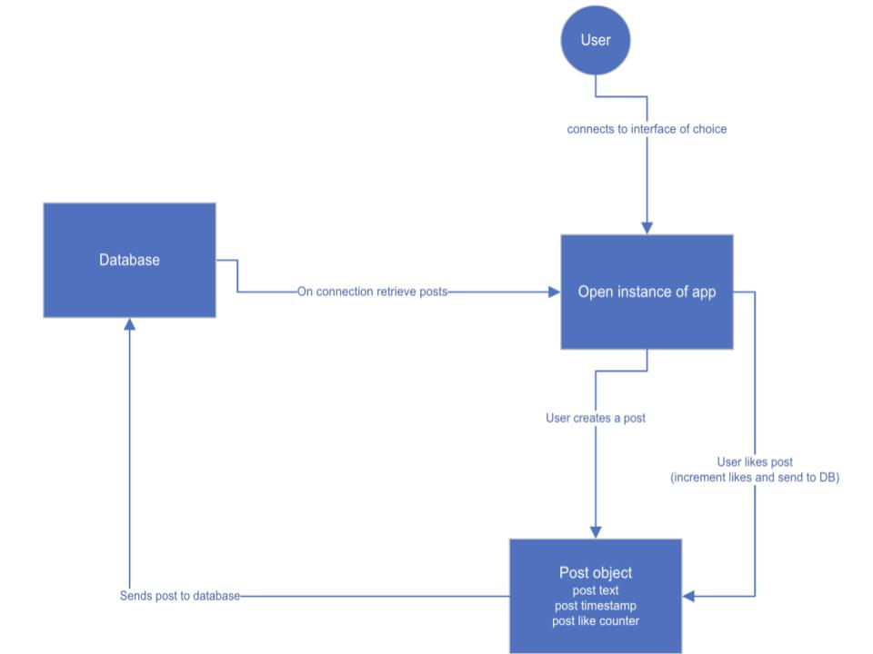
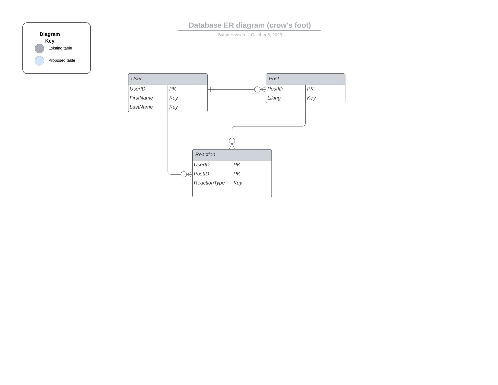

### (1) Team info
- Team number; 30
- team name; pioneers
- team members:
  - Samir Hasan, backend, ssh225@lehigh.edu
  - Ethan First, mobile, erf225@lehigh.edu
  - Owen Fleischer, web, odf226@lehigh.edu
  - Thomas Richardson, admin, tkr225@lehigh.edu
  - Elif Ozturk, PM, eeo224@lehigh.edu

### (2) Links
- git repo URL, https://bitbucket.org/team-30-workspace/cse216-2023fa-team-30/src/master/
- trello board URL, https://trello.com/w/cse2162023fateam30/home
- backend URL http://2023fa-tutorial-pioneers.dokku.cse.lehigh.edu/

### (3) Concise description of the functionality in this tagged release
This README file includes the design for phase 1. There are user stories and testing for them, state machine drawing, web/mobile user interface, system drawing, entitity relationship drawing, and testing for each role 

### (4) Instructions on building and running locally and on dokku
- To run on dokku:  
- git checkout web
- cd web
- Run sh local-deploy.sh

--- 
# Design

## Listing of user stories for the admin and “anonymous user” personas

- As an anonymous user I want to post anonymous messages so I can remain unknown   
- As an anonymous user I want to like messages without people knowing so I can test its popularity.   
- As an admin user I want to restrict login access to this app (limited to an organization) so that outside users cannot access company information

## Tests for each user story (identify manual vs. automated)
*As an anonymous user I want to post anonymous messages so I can remain unknown.*

#### Manual
- Users can post without providing any personal information, for example, not having to log in to post something.
- Make sure that when a user posts something it remains anonymous, for example, not seeing their name in the post and instead “Anonymous comp”.  

#### Automated   
- Checking the backend branch to make sure that user information remains confidential. 

*As an anonymous user I want to like messages without people knowing so I can test its popularity.*  

#### Manual 
- Manually check that a user can like messages without their personal information or identity revealed. 
- On a post, see the liked users list, and make sure that the list is all full of anonymous names instead of personal ones. 
#### Automatic
- Checking the “like” function on the web branch connected to the database to ensure that everything remains anonymous. 

*As an admin user I want to restrict login access to this app (limited to an organization) so that outside users cannot access company information.*
#### Manual 
- Try to log in as an “outside user” not part of the organization, and ensure that you cannot log in, for example, some error message being shown that you need to have special access. 
#### Automatic
- Tests can be “mimicked” to show a login attempt for someone who is not part of the organization and gets a “special access needed” message. 

## Drawing of a mock web/mobile user interface

## System drawing 

## State machine drawing 

## Listing of the routes, their purpose, and the format of any passed object

The goal is to start small... a cloud-hosted web system, plus a mobile app, so that employees can post short ideas (messages), and other employees can like (and remove a like from) that idea

- Spark.post("/users", (request, response))  
- Spark.post("/reaction", (request, response))
- Spark.post("/post", (request, response))
- Spark.get("/users/:id", (request, response))
- Spark.get("/reaction/:id", (request, response))
- Spark.get("/post/:id", (request, response))
- Spark.delete("/users/:id", (request, response))
- Spark.delete("/reaction/:id", (request, response))
- Spark.delete("/post/:id", (request, response))

Their purposes listed from top to bottom are 
- This is for adding a new user  

- This is for adding a new reaction  

- This is for adding a new post
- This is for getting a userID which we can use to later update/remove
- This is for getting a reactionID which we can use to later update/remove
- This is for getting a postID which we can use to later update/remove
- This is for deleting the user once we get the ID
- This is for deleting the reaction once we get the ID
- This is for deleting the post once we get the ID

## Entity relationship diagram

## Listing (description) of the tests for the backend, admin, web, and mobile
#### Web  

- Test the methods of creating a post and liking a post.  

- Test the functionality of the add message button. Seeing if it changes what is shown on the app. (test similar functionality with other buttons)  

- Test the ability to display all the current messages stored in the database onto the frontend.  

#### Backend
- The backend should test for the GET, POST, DELETE, and PUT routes as they should match the any changes to a POST, REACTION, OR USER
- We need to test every non-private method of every class
- We need to consider all edge cases such as a message or post exceeding the character limit
- We need to test all common cases such as an input not matching the input we are using to make changes to the backend
- We need to test all functionality of our code which means edge cases + common cases + uncommon cases + all other cases
- We are yet to make a Test for each class in the /main hierarchy.
- An example of a test I will make is DataStore, in which we should look at return values to see if index values get reused.
- We will "mock" components of our application, so that we can test other pieces in a controlled environment which means we can do testing without an active connection and even test on a second database without any live data

#### Admin Unit Testing:
We want to determine whether ElepehantSQL is receiving the command line inputs properly and setting up the data in our database. Our tests will ensure that all tables and rows are inputted correctly by verifying that whatever information was inputted from the command line is the same in the database, ensuring no data corruption/loss along the way, or to ensure it reaches the correct destination.

#### Flutter Testing

Retrieving data:
 Test connection to dokku/backend by using a test data value and confirm the response is what was expected

Increment Likes:
 Send request to server and check that response contains one more than the previous amount of likes

Create post:
 Check that a new post is saved in the server correctly and displays to the user correctly